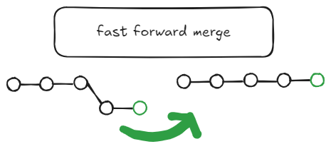
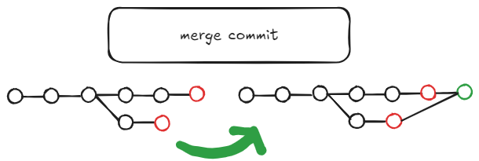

# Learn git

**Table of Contents**

- [Git main concepts](#git-main-concepts)
- [Git Merge](#git-merge)
- [Git stash](#git-stash)
- [Git remote - github](#git-remote---github)
- [Git fetch and pull](#git-fetch-and-pull)
- [Git .gitignore](#git-gitignore)


## Git main concepts

| Primary                                                                                                                           | Secondary                                                         |
| --------------------------------------------------------------------------------------------------------------------------------- | ----------------------------------------------------------------- |
| Git config -l<br>Git config --global user. Name " "<br>Git config --global user. Email " "<br>                                    |                                                                   |
| Git init <br>Git add . <br>Git commit -m " "                                                                                      | Git  status <br>Git commit -am " "                                |
| Git log <br>Git log --all <br>Git log --oneline <br>Git log --graph <br>Git log --graph --all <br>Git log --oneline --graph --all | Git branch <br>Git diff <br>Git diff --cached <br>Git diff `hash` |
| git checkout `hash` <br>Git checkout master                                                                                       |                                                                   |
| git branch `name` <br>git checkout `name`                                                                                         | git checkout -b `name`<br>git branch -d `name`                    |

```bash
git config -l
git config --global user.name "Fajel Rayhan"
git config --global user.email "rayhan01681@gmail.com"

git init 
git add . 
git commit -m " "  
----------------
git  status 
git commit -am " "

git log 
git log --all 
git log --oneline 
git log --graph 
git log --graph --all 
git log --oneline --graph --all 
--------------------------
git branch 
git diff 
git diff --cached 
git diff `hash`

git checkout `hash` 
git checkout master 

git branch `name` 
git checkout `name` 
-----------------
git checkout -b `name`
git branch -d `name` 
```

## Git Merge

```bash
git checkout master
git merge `name`
```


```bash
git checkout master
git merge `name`
# solve merge conflict manualy
# accept master |  accept branch | accept both 
git branch -d `name`
```

## Git stash

```bash
git status 
git stash  # you can stash  multiple time and with massage attach to it 
---------
git stash apply  # bring back your work from stash 
```

## Git remote - github
```bash
git remote -v 
git remote add origin `github-repo-link`
git push origin master 
---------------------
git checkout -b `name`
git commit -am " "
git push origin `branch-name`
# or 
git push origin `branch-name`:`github-branch-name`
```

## Git fetch and pull
```bash 
git fetch 
git log --graph --all
git merge 
# with out doing all thouse 3 use pull
git pull origin master 
```

## Git .gitignore 
```
.gitignore
	node_modules 
	file-test.js
```

